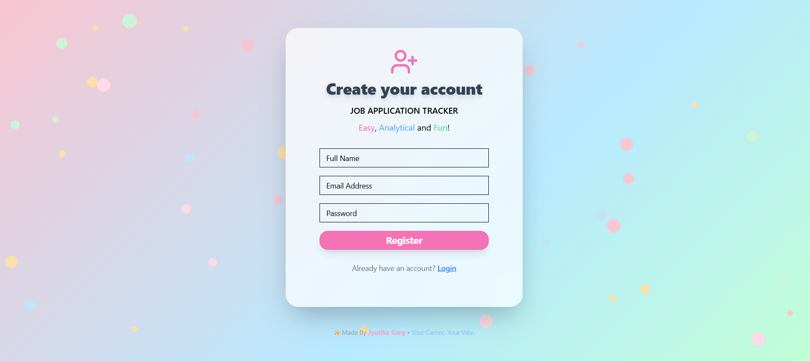

# CareerCompass
Full-Stack Job Application Tracker

A beautifully designed, full-stack job application tracker built with React, Vite, TypeScript, Tailwind, shadcn/ui, PostgreSQL (via Prisma), and Node.js/Express.  
Track every job you apply to, manage your progress, and keep your motivation high with a polished and animated UI!

## ✨ Features

- User registration, login, JWT-protected sessions
- Forgot password & reset password flows
- Add, edit, and delete job applications
- Track company, position, date, status, notes & more
- Fun, engaging, and animated interface (pastel, glassmorphism, icons)
- Secure backend (Node.js, Express, JWT, Prisma, PostgreSQL)

## 📸 Screenshots

>  - Register

---

## 🚀 Tech Stack

- **Frontend:** React, Vite, TypeScript, Tailwind CSS, shadcn/ui, framer-motion, lucide-react, react-tsparticles
- **Backend:** Node.js, Express, Prisma ORM, PostgreSQL, JWT, bcryptjs
- **Dev Tools:** VS Code, Docker (optional), Railway/Postgres cloud hosting (optional)

---

## Local Setup

**1. Clone the repo:**

```bash
git clone https://github.com/yourusername/career-compass.git
cd career-compass
2. Frontend:

bash
Copy
cd frontend
npm install
cp .env.example .env   # Edit VITE_API_URL if needed
npm run dev
3. Backend:

bash
Copy
cd backend
npm install
cp .env.example .env   # Set your PostgreSQL DATABASE_URL and JWT_SECRET
npx prisma migrate dev
npm run dev
4. Visit:
Open http://localhost:5173 in your browser.

📝 How it works
Register/Login: Create an account and login securely

Forgot Password: Reset your password via email link (simulated in backend logs)

Add Job Application: Click the + button, fill details, and track your applications

Edit/Delete: Update or remove applications from your dashboard
